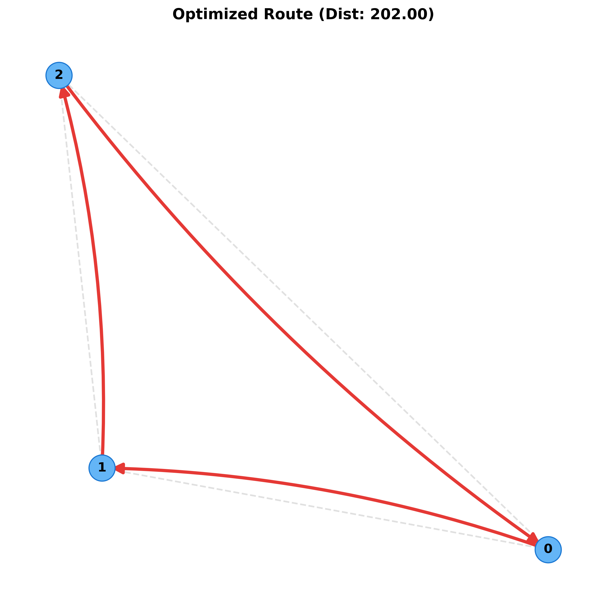

# Supply Chain Route Optimization with QAOA (Qiskit)

## Overview
This repository demonstrates how to formulate a **supply‑chain route optimization** problem (a Travelling‑Salesperson‑style formulation) as a QUBO and solve it with the **Quantum Approximate Optimization Algorithm (QAOA)** using Qiskit.

- **Larger graphs**: The demo supports arbitrary numbers of locations (nodes) via a command‑line argument (`--nodes`).
- **Custom data import**: Supply a CSV distance matrix with `--data-file`.  The file must be a symmetric matrix with headers representing node names.
- **IBMQ backend**: If you provide an IBM Quantum token in the environment variable `IBMQ_TOKEN` and invoke the script with `--use‑ibmq`, the QAOA circuit will be executed on a real quantum device (or the IBMQ simulator).

The code is deliberately lightweight, uses the high‑level `qiskit‑optimization` utilities, and includes a visualisation of the resulting route.

## Repository Structure
```
├── README.md                # (this file) – detailed documentation
├── .gitignore               # standard python ignores
├── LICENSE                  # MIT License
├── requirements.txt         # Python dependencies
├── run.py                   # Entry‑point script with CLI
└── src
    ├── __init__.py
    ├── problem.py           # Problem definition & data loading
    ├── qaoa_solver.py       # QAOA wrapper
    └── visualization.py     # Graph visualisation
```

## Installation
```bash
# Clone the repo (if you copy this folder elsewhere)
# git clone <repo‑url>

# Create a virtual environment
python -m venv .venv
.\.venv\Scripts\activate   # Windows PowerShell

# Install dependencies
pip install -r requirements.txt
```

## Usage
```bash
# Basic run with a synthetic 6‑node graph (default)
python run.py

# Larger graph (e.g., 12 nodes)
python run.py --nodes 12

# Use a custom distance matrix CSV (must be square, comma‑separated)
python run.py --data-file my_distances.csv

# Run on a real IBM Quantum device (set IBMQ_TOKEN env var first)
set IBMQ_TOKEN=YOUR_IBM_TOKEN
python run.py --use-ibmq
```

### CSV format example
```csv
,0,1,2,3,4,5
0,0,10,15,20,25,30
1,10,0,35,25,15,20
2,15,35,0,30,20,25
3,20,25,30,0,10,15
4,25,15,20,10,0,5
5,30,20,25,15,5,0
```
The first column/row are node identifiers. The matrix must be symmetric (distance(i,j) = distance(j,i).

## IBMQ Backend Details
1. **Set your token**: `set IBMQ_TOKEN=YOUR_TOKEN` (PowerShell) or `export IBMQ_TOKEN=YOUR_TOKEN` (bash).
2. **Select a backend**: The script will automatically pick the least‑busy device suitable for the problem size. If no device is available, it falls back to the `ibmq_qasm_simulator`.
3. **Authentication**: The script loads the account using `IBMQ.save_account(token, overwrite=True)` (first run) and then `IBMQ.load_account()`.

## Visualisation
After solving, a Matplotlib window/file is generated showing the complete graph (light gray edges) and the selected route (red edges) with node labels.



## License
This project is released under the **MIT License** (see `LICENSE`).

---
*Feel free to fork, extend the problem formulation (add capacity constraints, multi‑modal transport, etc.), or experiment with different QAOA depths.*
